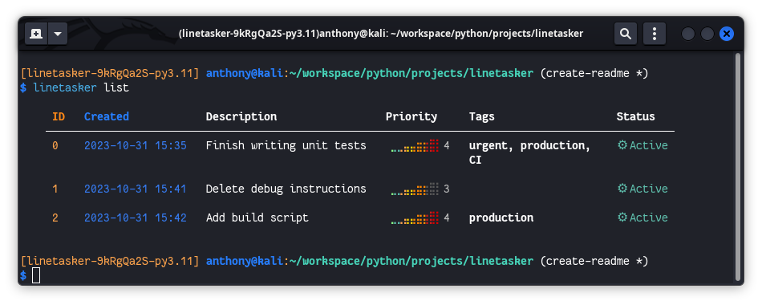
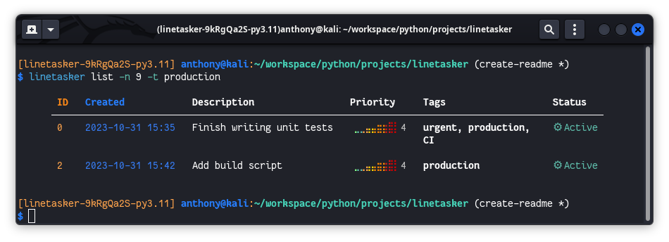

# Line[Tasker]: A pretty and simple project-scope TODO list in command line.
> [!Important]
> You have to install a <a href="https://www.nerdfonts.com/">Nerd Font</a>
 in order to display correctly some symbols


## I - Create a new task
```shell
$ linetasker new "Finish writing unit tests"
```
### I.2 -  Priority and tags
```shell
$ linetasker new "Finish writing unit tests" -p 5 --tags urgent --tags production --tags CI
```
> `-p` / `--priority`: priority of the task 1 -> 5 [1 by default]

> `-t`/ --`tags`: add tags to the task

## II - List tasks
```shell
$ linetasker list
```

### II.2 - Filtering

```shell
$ linetasker list -n 9 -t production
```
> `-n`: number of the tasks to display from the top
> `-t`: filter by tags


## III - Mark as done
```shell
$ linetasker done <ID>
```
> `ID`: integer

## IV - Delete task(s)
### IV.1 Delete one task
```
$ linetasker del <ID>
```
### IV.2 - Delete all done tasks
```
$ linetasker clean
```
### IV.3 - Clear all tasks
```
$ linetasker reset -y
```
> `-y`: flag for bypassing confirmation prompt
