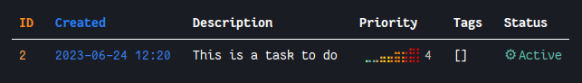

# Line[Tasker]: A pretty and simple project-scope TODO list in command line.

## Features:

- Create new task:
```shell
$ linetasker new "This is a task to do" -p 4
```
> `-p` : Priority of the task

- List tasks:
```shell
$ linetasker list
```



- Mark task as done

- Delete a task
